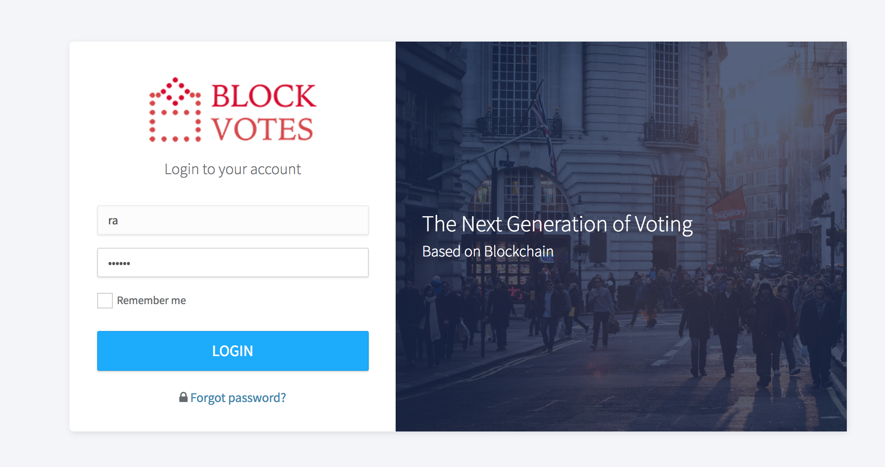
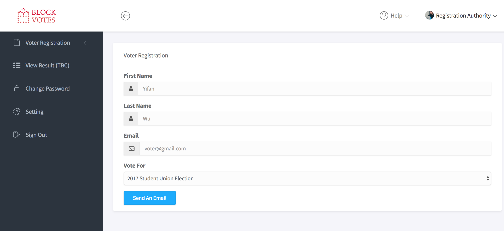
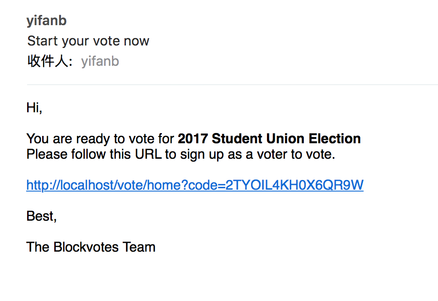
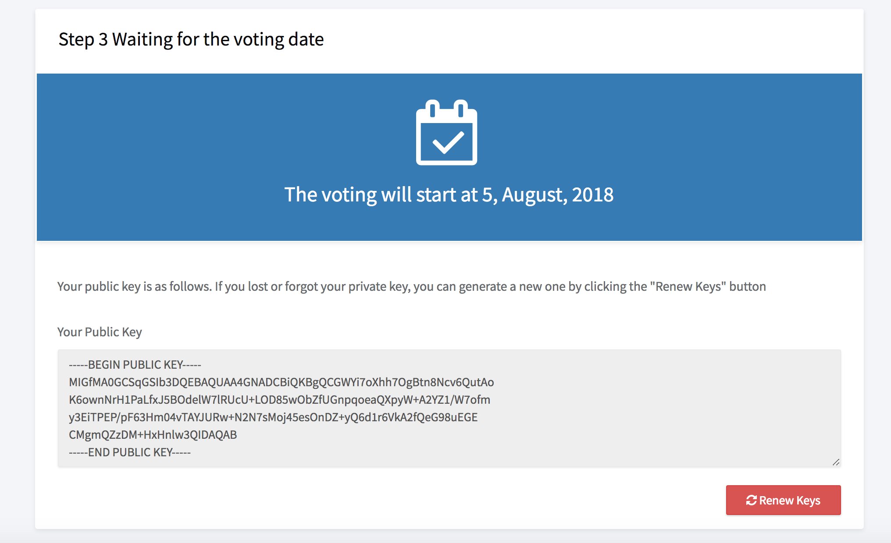
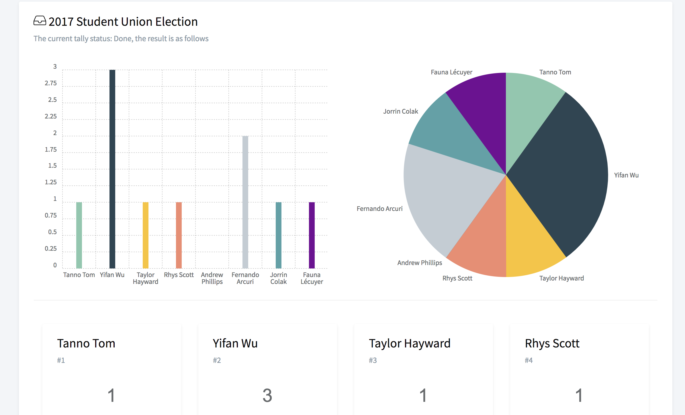
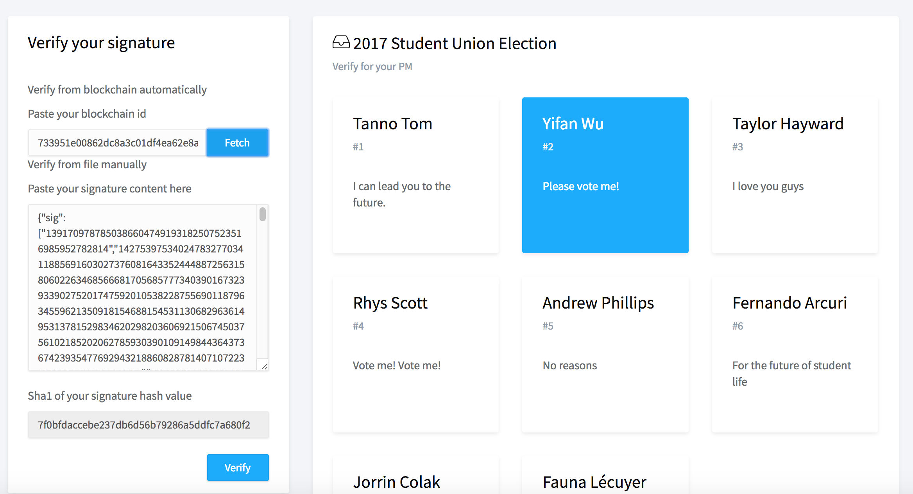

# BlockVotes
**An e-voting system based on blockchain using ring signature**


**Demo Video: https://www.youtube.com/watch?v=4c6pQg3q4Vc**

**Slides**: [blockvotes.pdf](blockvotes.pdf)


### Instruction

To run the whole system, there are a lot works to do.

**Recommended Running Environment** 

1. Operation System: Mac OS X or Linux or Windows
2. Apache ‎2.4.27 or Nginx 1.12.1
3. MySQL 5.7.19 (at least 5.4)
4. PHP ‎7.1.8 (at least 7.0)
5. php7.0-gmp
6. composer

**php7.0-gmp**

php7.0-gmp is a package used for the Elliptic Curve Digital Signature Algorithm (ECDSA). If you are using the Linux, please do the following things.

To install GMP on PHP7 on Ubuntu:

Run: `sudo apt-get install php7.0-gmp`

And add the following to php.ini:

`extension=php_gmp.so`

To install GMP on PHP7 on Mac OS X:

Run:

```
brew tap homebrew/dupes
brew tap homebrew/versions
brew tap homebrew/homebrew-php
brew install php71
brew install php71-gmp
```

And add the following to php.ini:

`extension=php_gmp.so`

To nstall GMP on PHP7 on Windows:

uncomment `;extension=php_gmp.dll` in `php.ini`

**Apache configuration**

Ensure your `.htaccess` and `index.php` files are in the same public-accessible directory. The `.htaccess` file should contain this code:

```
RewriteEngine On
RewriteCond %{REQUEST_FILENAME} !-f
RewriteCond %{REQUEST_FILENAME} !-d
RewriteRule ^ index.php [QSA,L]
```

Make sure your Apache virtual host is configured with the `AllowOverride` option so that the `.htaccess` rewrite rules can be used:

```
AllowOverride All
```

**Nginx configuration**

This is an example Nginx virtual host configuration for the domain `example.com`. It listens for inbound HTTP connections on port 80. It assumes a PHP-FPM server is running on port 9000. You should update the `server_name`, `error_log`,`access_log`, and `root` directives with your own values. The `root` directive is the path to your application’s public document root directory; your Slim app’s `index.php`front-controller file should be in this directory.

```
server {
    listen 80;
    server_name example.com;
    index index.php;
    error_log /path/to/example.error.log;
    access_log /path/to/example.access.log;
    root /path/to/public;

    location / {
        try_files $uri /index.php$is_args$args;
    }

    location ~ \.php {
        try_files $uri =404;
        fastcgi_split_path_info ^(.+\.php)(/.+)$;
        include fastcgi_params;
        fastcgi_param SCRIPT_FILENAME $document_root$fastcgi_script_name;
        fastcgi_param SCRIPT_NAME $fastcgi_script_name;
        fastcgi_index index.php;
        fastcgi_pass 127.0.0.1:9000;
    }
}
```

(reference: https://www.slimframework.com/docs/start/web-servers.html)

For the whole project,  directory `public` is the entrance of the system.  If you can not open the page, please check it if is configured correctly in the Nginx or Apache.

**BlockVotes configuration** 

To run the system, some critical but private information are not uploaded by ``gitingore`` file. Please add the `.env` file into the root of this project directory.

```
DB_DRIVER=mysql
DB_HOST=127.0.0.1
DB_DATABASE=blockvotes
DB_USERNAME=root
DB_PASSWORD=
DB_PORT=3306

STMP_SERVER=smtp.gmail.com
STMP_PORT=465
STMP_USERNAME=xxx@gmail.com
STMP_PASSWORD=password
```

**Database**

The sample SQL file is generated and uploaded as the file[ `blockvotes.sql`](https://gist.github.com/yfgeek/75c53298d59f335c65a6cc03703ec02e) , please import it to MySQL.

**Composer**

composer is a dependency management tool for PHP.  Please ensure all dependencies has been installed before running the system

```
php composer.phar install
```

### Topic 

E-voting systems will be beneficial to all people who are involved in elections. For example, administrators can improve operation of tasks for elections, and voters can vote in an election anytime and anywhere. In addition, ideal e-voting systems have transparency, completeness (only voters have the right to vote and their votes are correctly counted), and verifiability (voters can check that their vote is correctly counted), and therefore it is better than existing voting system.

Digital voting is the use of electronic devices, such as voting machines or an internet browser, to cast votes. These are sometimes referred to as e-voting whenvoting using a machine in a polling station, and e-voting when using a web browser.

Security of digital voting is always the biggest concern when considering to implement a digitalvoting system. With such monumental decisions at stake, there can be no doubt about the system’s ability to secure data and defend against potential attacks. One way the security issues can be potentially solved is through the technology of blockchains.

Blockchain technology originates from the underlying architectural design of the crypto currency bitcoin. It is a form of distributed database where records take the form of transactions, a block is a collection of these transactions. With the use of blockchains a secure and robust system for digital voting can be devised. 

To solve the problem, I propose a way to use the ring signature and the blockchain to ensure the features of the e-voting. The blockchain technology is characterized by decentralization, irreversibility, distribution of joint accounting, asymmetric encryption and data-security.

### Blockchain

The blockchain can be described as an immutable, cumulative ledger, with consensus protocol working to maintain this ledger of all valid transactions on every node in the network. 

**OP_RETURN**

OP_RETURN is a script opcode used to mark a transaction output as invalid. Since any outputs with OP_RETURN are provably unspendable, OP_RETURN outputs can be used to burn bitcoins.			

​	

### Ring Signature


1. A group of entities each have public/private key pairs, (*P*1, *S*1), (*P*2, *S*2), ..., (*Pn*, *Sn*). 
2. a ring signature: σ = (m, Si, P1,P2,……,Pn)
3. Anyone can check the validity of a ring signature given σ, *m*, and the public keys involved, *P*1, ..., *Pn*

### Tools & Framework


### The Protocol

Please see the paper.

### Screenshot














